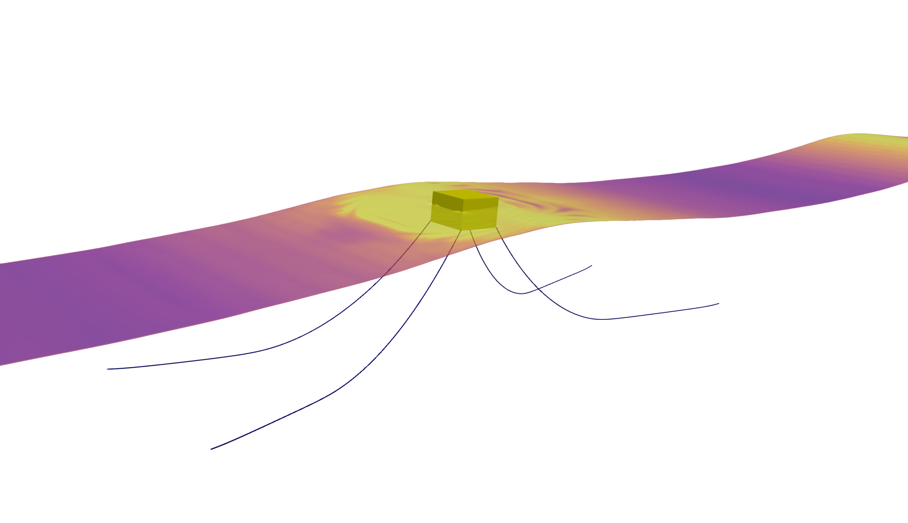
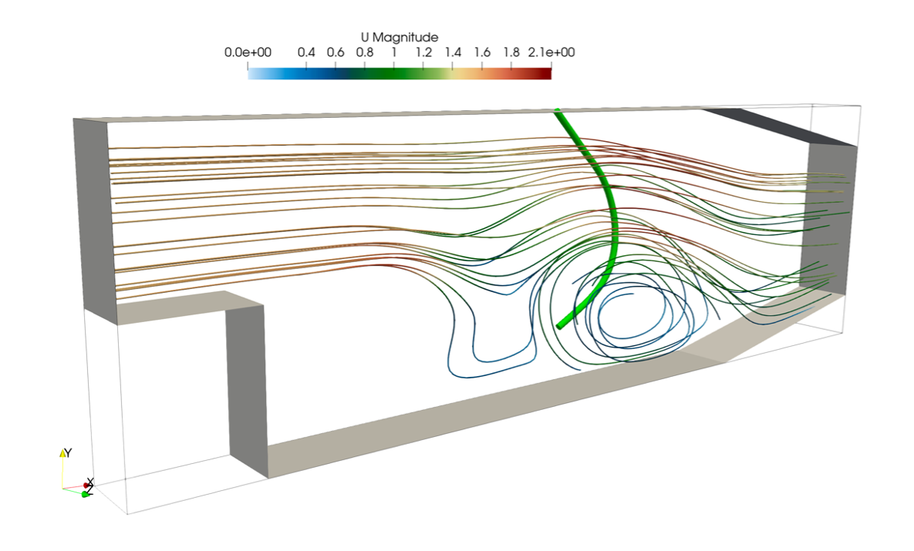

# moorFV
moorFV is a coupling library for mooring applications in OpenFOAM, with extensions for beam-fluid interaction problems. It provides finite-volume-based tools and examples for coupling floating-body motion, mooring-line dynamics, and beam-fluid interaction workflows.

<p align="center">
  
  
</p>


## Requirements

- OpenFOAM, tested with OpenFOAM.com-style installations.
- [`beamFoam`](https://github.com/solids4foam/beamFoam), which is a mandatory submodule for this library.
- A working OpenFOAM build environment with `wmake` available in the shell.

Initialize the required submodule after cloning:

```bash
git submodule update --init --recursive
```

The [`beamFoam`](https://github.com/solids4foam/beamFoam) submodule is located at:

```text
src/beamFoam
```

By default, moorFV builds against this bundled submodule. If you want to use
your own beamFoam checkout instead, set `BEAMFOAM_DIR` before building:

```bash
export BEAMFOAM_DIR=/path/to/beamFoam
```

The selected beamFoam installation must already be compiled, because moorFV
uses beamFoam headers from:

```text
$BEAMFOAM_DIR/src/wireBunchingModels/lnInclude
```

If that directory is missing, compile beamFoam first:

```bash
cd "$BEAMFOAM_DIR"
./Allwmake -j
```

## Building

Load your OpenFOAM environment first, then build from the repository root:

```bash
./Allwmake
```

The root `Allwmake` delegates to `src/Allwmake`. The `src/Allwmake` script
resolves `BEAMFOAM_DIR` as follows:

- If `BEAMFOAM_DIR` is set, it validates and uses that path.
- If `BEAMFOAM_DIR` is not set, it uses the bundled submodule at
  `src/beamFoam`.
- If the submodule is missing or uninitialized, it prints the required
  `git submodule update --init --recursive src/beamFoam` command.

This means both of the following are valid:

```bash
./Allwmake
```

```bash
cd src
./Allwmake
```

To clean generated build files:

```bash
./Allwclean
```

## Tutorials

Example cases are provided in:

```text
tutorial/
```

The current tutorial structure includes mooring cases and beam-fluid interaction cases, including:

- `tutorial/mooringCase-H12T20`
- `tutorial/mooringCase-H15T18`
- `tutorial/beamFluidInteractionCases/pitzDailyWithBeam`

Each case should be run from its own directory using the local `Allrun` and `Allclean` scripts when available.

## Citation

If you use moorFV or the finite-volume mooring-line method in your work, please cite:

Taran, A., Bali, S., Tukovic, Z., Pakrashi, V., and Cardiff, P. (2025). A finite volume Simo-Reissner beam method for moored floating body dynamics. Applied Ocean Research, 165, 104845. https://doi.org/10.1016/j.apor.2025.104845

## Contacts

For questions, please contact:

- Amirhossein Taran: amirhossein.taran@ucdconnect.ie
- Philip Cardiff: philip.cardiff@ucd.ie

## License

This project is distributed under the GNU General Public License v3.0. See `LICENSE` for details.
